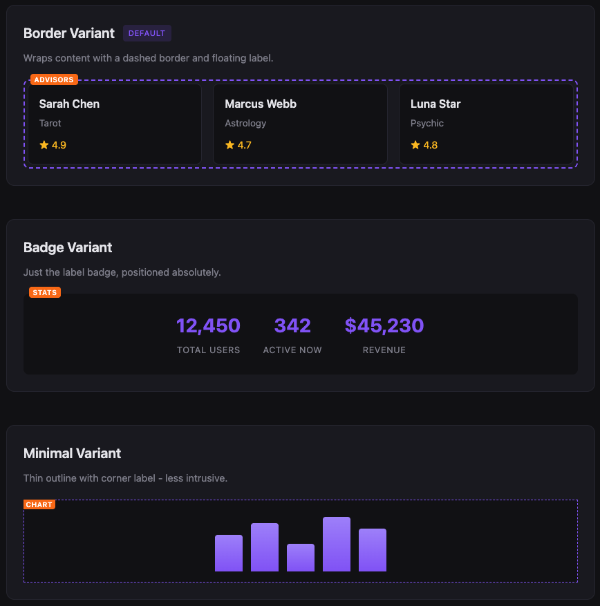

<p align="center">
  
</p>

<h1 align="center">MockMark</h1>

<p align="center">
  <strong>Development-only visual indicators for mock data in React applications.</strong>
</p>

<p align="center">
  <a href="#installation">Installation</a> •
  <a href="#usage">Usage</a> •
  <a href="#variants">Variants</a> •
  <a href="#props">Props</a>
</p>

---

## Installation

```bash
npm install mockmark
```

## Usage

### Basic Usage

```tsx
import { MockMark } from 'mockmark'

function AdvisorList() {
  return (
    <MockMark label="Advisors" reason="Not connected to database">
      <div className="grid">
        {mockAdvisors.map(advisor => (
          <AdvisorCard key={advisor.id} advisor={advisor} />
        ))}
      </div>
    </MockMark>
  )
}
```

### Global Configuration

```tsx
import { MockMarkProvider } from 'mockmark'

function App() {
  return (
    <MockMarkProvider 
      enabled={process.env.NODE_ENV === 'development'}
      defaultVariant="border"
      tooltipTrigger="hover"
      theme={{ borderColor: '#8b5cf6' }}
    >
      <YourApp />
    </MockMarkProvider>
  )
}
```

### Tooltip Trigger Modes

MockMark displays the `reason` prop as an elegant tooltip. Choose how tooltips are triggered:

- `hover` (default): Tooltip appears when hovering over the MockMark container
- `click`: Tooltip appears when clicking the label badge (allows click-through to content beneath)

```tsx
// Click mode - great for touch devices or when content has hover interactions
<MockMarkProvider tooltipTrigger="click">
  <MockMark reason="Click the label to see this">
    <YourComponent />
  </MockMark>
</MockMarkProvider>
```

### Variants

- `border` (default): Dashed border around content with floating label
- `badge`: Just the label badge positioned absolutely
- `minimal`: Thin outline with corner label

```tsx
<MockMark variant="minimal" label="API">
  <DataTable />
</MockMark>
```

## Props

### MockMark Component

| Prop | Type | Default | Description |
|------|------|---------|-------------|
| `label` | string | "MOCK" | Badge text |
| `reason` | string | - | Tooltip description |
| `variant` | 'border' \| 'badge' \| 'minimal' | 'border' | Visual style |
| `disabled` | boolean | false | Force hide this instance |

### MockMarkProvider

| Prop | Type | Default | Description |
|------|------|---------|-------------|
| `enabled` | boolean | true | Enable/disable all indicators |
| `defaultVariant` | 'border' \| 'badge' \| 'minimal' | 'border' | Default visual style |
| `tooltipTrigger` | 'hover' \| 'click' | 'hover' | How tooltips are triggered |
| `theme` | MockMarkTheme | - | Custom styling |

### Theme Options

```tsx
interface MockMarkTheme {
  borderColor?: string      // Indicator border color
  labelBg?: string          // Badge background color
  labelColor?: string       // Badge text color
  labelFontSize?: string    // Badge font size
  tooltipBg?: string        // Tooltip background color
  tooltipColor?: string     // Tooltip text color
  tooltipFontSize?: string  // Tooltip font size
}
```

## Demo

See MockMark in action using the included demo app. It showcases all variants and usage patterns in a realistic React environment.



To run the demo locally:

```bash
npm run dev:example
```

## License

MIT

