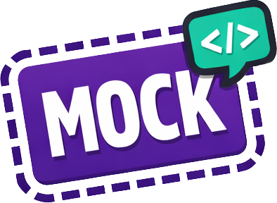

<p align="center">
  
</p>

<h1 align="center">MockMark</h1>

<p align="center">
  <strong>Development-only visual indicators for mock data in React, Vue, and Angular applications.</strong>
</p>

<p align="center">
  <a href="https://www.npmjs.com/package/mockmark"></a>
  <a href="https://www.npmjs.com/package/mockmark"></a>
  <a href="https://github.com/orangebread/mockmark/blob/main/LICENSE"></a>
</p>

<p align="center">
  <a href="#installation">Installation</a> •
  <a href="#usage">Usage</a> •
  <a href="#variants">Variants</a> •
  <a href="#props">Props</a> •
  <a href="#contributing">Contributing</a>
</p>


MockMark is a development-only library for developers who prototype UI components with mock data before integrating real APIs or databases.

When building front-end first, it's easy to lose track of which components are still using placeholder data—especially as your app grows. MockMark wraps mock-data-driven components with subtle visual indicators (borders, badges, or minimal outlines) so you always know what's "real" vs. "fake" at a glance.

## Use Cases

- **Frontend-first workflows** — Build and iterate on UI before backend APIs exist
- **AI-Assisted Development** — Visually distinguish between AI-generated mock implementations and finalized, production-ready code
- **Design system development** — Clearly mark placeholder content in component libraries
- **Onboarding & handoffs** — New team members instantly see what still needs integration
- **Sprint planning** — Use MockMark as a living checklist of unfinished data connections
- **Demo builds** — Ensure you never accidentally ship mock data by making it visually obvious
- **Code reviews** — Reviewers can spot mock dependencies without digging through code

## Why MockMark?

Unlike `// TODO` comments buried in code, MockMark surfaces incomplete work directly in the UI where you can't ignore it. This is especially powerful when pair-programming with AI: it creates an unambiguous visual distinction between AI-scaffolded mock implementations and finalized code. The visual feedback disappears automatically in production (via the `enabled` prop), so there's zero risk of shipping debug artifacts.

---

## Installation

### React

```bash
npm install mockmark
```

### Vue

```bash
npm install @mockmark/vue
```

### Angular

```bash
npm install @mockmark/angular
```

---

## Usage

### React

```tsx
import { MockMark, MockMarkProvider } from 'mockmark'

// Wrap your app with the provider
function App() {
  return (
    <MockMarkProvider 
      enabled={process.env.NODE_ENV === 'development'}
      defaultVariant="border"
      tooltipTrigger="hover"
    >
      <YourApp />
    </MockMarkProvider>
  )
}

// Mark components with mock data
function AdvisorList() {
  return (
    <MockMark label="Advisors" reason="Not connected to database">
      <div className="grid">
        {mockAdvisors.map(advisor => (
          <AdvisorCard key={advisor.id} advisor={advisor} />
        ))}
      </div>
    </MockMark>
  )
}
```

### Vue

```vue
<script setup>
import { MockMark, MockMarkProvider } from '@mockmark/vue'
</script>

<template>
  <MockMarkProvider :enabled="isDev" default-variant="border">
    <MockMark label="Users" reason="Using mock data">
      <UserList :users="mockUsers" />
    </MockMark>
  </MockMarkProvider>
</template>
```

### Angular

```typescript
import { MockMarkComponent, MockMarkProviderComponent } from '@mockmark/angular'

@Component({
  selector: 'app-root',
  standalone: true,
  imports: [MockMarkComponent, MockMarkProviderComponent],
  template: `
    <mockmark-provider [enabled]="isDev" defaultVariant="border">
      <mockmark label="Products" reason="Static mock data">
        <app-product-list [products]="mockProducts" />
      </mockmark>
    </mockmark-provider>
  `
})
export class AppComponent {
  isDev = !environment.production
  mockProducts = [...]
}
```

---

## Configuration

### Global Configuration (React)

```tsx
import { MockMarkProvider } from 'mockmark'

function App() {
  return (
    <MockMarkProvider 
      enabled={process.env.NODE_ENV === 'development'}
      defaultVariant="border"
      tooltipTrigger="hover"
      theme={{ borderColor: '#8b5cf6' }}
    >
      <YourApp />
    </MockMarkProvider>
  )
}
```

### Tooltip Trigger Modes

MockMark displays the `reason` prop as an elegant tooltip. Choose how tooltips are triggered:

- `hover` (default): Tooltip appears when hovering over the MockMark container
- `click`: Tooltip appears when clicking the label badge (allows click-through to content beneath)

```tsx
// Click mode - great for touch devices or when content has hover interactions
<MockMarkProvider tooltipTrigger="click">
  <MockMark reason="Click the label to see this">
    <YourComponent />
  </MockMark>
</MockMarkProvider>
```

### Markdown in Tooltips

The `reason` prop supports markdown formatting for richer descriptions:

```tsx
<MockMark 
  label="API" 
  reason="**Status:** Waiting on backend

This endpoint needs:
- `GET /api/users` for listing
- `POST /api/users` for creation

See [API docs](https://docs.example.com) for details."
>
  <UserTable />
</MockMark>
```

Supported markdown:
- **Bold**: `**text**` or `__text__`
- *Italic*: `*text*` or `_text_`
- `Code`: `` `code` ``
- [Links]: `[text](url)`
- Line breaks: newlines are preserved

---

## Variants

- `border` (default): Dashed border around content with floating label
- `badge`: Just the label badge positioned absolutely
- `minimal`: Thin outline with corner label

```tsx
<MockMark variant="minimal" label="API">
  <DataTable />
</MockMark>
```

---

## Props

### MockMark Component

| Prop | Type | Default | Description |
|------|------|---------|-------------|
| `label` | string | "MOCK" | Badge text |
| `reason` | string | - | Tooltip description (supports markdown) |
| `variant` | 'border' \| 'badge' \| 'minimal' | 'border' | Visual style |
| `disabled` | boolean | false | Force hide this instance |
| `labelBg` | string | - | Override label badge background color |
| `labelColor` | string | - | Override label text color |
| `borderColor` | string | - | Override border/outline color |
| `tooltipBg` | string | - | Override tooltip background color |
| `tooltipColor` | string | - | Override tooltip text color |

### MockMarkProvider

| Prop | Type | Default | Description |
|------|------|---------|-------------|
| `enabled` | boolean | true | Enable/disable all indicators |
| `defaultVariant` | 'border' \| 'badge' \| 'minimal' | 'border' | Default visual style |
| `tooltipTrigger` | 'hover' \| 'click' | 'hover' | How tooltips are triggered |
| `theme` | MockMarkTheme | - | Custom styling |

### Theme Options

```tsx
interface MockMarkTheme {
  borderColor?: string      // Indicator border color
  labelBg?: string          // Badge background color
  labelColor?: string       // Badge text color
  labelFontSize?: string    // Badge font size
  tooltipBg?: string        // Tooltip background color
  tooltipColor?: string     // Tooltip text color
  tooltipFontSize?: string  // Tooltip font size
}
```

---

## Demo

See MockMark in action using the included demo apps. They showcase all variants and usage patterns in realistic environments.


To run the demos locally:

```bash
# React demo
npm run dev:react

# Vue demo
npm run dev:vue

# Angular demo
npm run dev:angular
```

---

## Packages

| Package | Description |
|---------|-------------|
| [`mockmark`](https://www.npmjs.com/package/mockmark) | React adapter |
| [`@mockmark/vue`](https://www.npmjs.com/package/@mockmark/vue) | Vue 3 adapter |
| [`@mockmark/angular`](https://www.npmjs.com/package/@mockmark/angular) | Angular 17+ adapter |
| `@mockmark/core` | Framework-agnostic core (internal) |

---

## Contributing

We welcome contributions! This is a pnpm monorepo.

```bash
# Clone the repo
git clone https://github.com/orangebread/mockmark.git
cd mockmark

# Install dependencies
pnpm install

# Build all packages
pnpm build

# Run the React demo
pnpm dev:react
```

### Project Structure

```
mockmark/
├── packages/
│   ├── core/      # Framework-agnostic utilities and styles
│   ├── react/     # React adapter (published as `mockmark`)
│   ├── vue/       # Vue adapter
│   └── angular/   # Angular adapter
└── examples/
    ├── react-demo/
    ├── vue-demo/
    └── angular-demo/
```

---

## License

MIT © [orangebread](https://github.com/orangebread)
